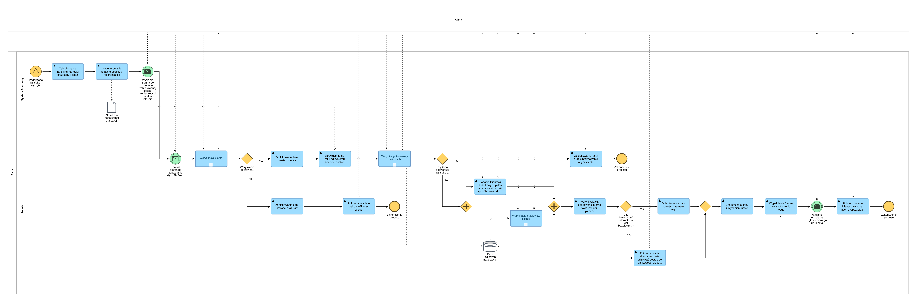

# BPMN_01_Fraud_Kartowy

## Cel procesu
Proces przedstawia główną ścieżkę obsługi klienta (Main Process) od momentu wykrycia podejrzanej transakcji przez system bankowy, aż do momentu zabezpieczenia środków i zarejestrowania zgłoszenia fraudowego.

## Opis przebiegu procesu
1. System bankowy wykrywa podejrzaną transakcję kartową, automatycznie ją blokuje, generuje notatkę i wysyła powiadomienie SMS do klienta.
2. Klient po zapoznaniu się z wiadomością kontaktuje się z infolinią.
3. Konsultant uruchamia podproces weryfikacji tożsamości klienta. W przypadku negatywnego wyniku proces zostaje zakończony z informacją o braku możliwości obsługi.
4. Po udanej weryfikacji następuje prewencyjne zablokowanie bankowości oraz kart, a konsultant sprawdza notatki systemowe.
5. Uruchamiany jest podproces weryfikacji transakcji kartowych. Jeśli klient potwierdzi, że to on wykonywał operacje, karta jest odblokowywana, a proces się kończy.
6. Jeśli klient nie potwierdza transakcji, konsultant zadaje dodatkowe pytania i uruchamia podproces weryfikacji przelewów.
7. Po analizie przelewów system podejmuje decyzję o bezpieczeństwie bankowości. Następuje jej odblokowanie (lub instruktaż odzyskania dostępu dla klienta), zastrzeżenie karty z wydaniem nowej oraz wysłanie formularza zgłoszeniowego.

## Uczestnicy procesu
| Rola | Odpowiedzialność |
| :--- | :--- |
| **Klient** | Kontakt z infolinią, autoryzacja tożsamości, weryfikacja poprawności operacji. |
| **Konsultant (Infolinia)** | Weryfikacja dzwoniącego, obsługa systemu, koordynacja wywiadu i podprocesów weryfikacyjnych. |
| **System Fraudowy** | Detekcja anomalii, automatyczne blokady, wysyłka komunikatów SMS. |

## Reguły biznesowe
| ID | Nazwa | Opis |
| :--- | :--- | :--- |
| **BR-01** | Blokada prewencyjna | Podejrzana aktywność skutkuje natychmiastowym zablokowaniem autoryzacji transakcji. |
| **BR-02** | Weryfikacja tożsamości | Dalsza obsługa klienta jest możliwa tylko po pozytywnym przejściu procedury KYC/2FA. |

## Podgląd diagramu

## Komentarz analityczny
Proces ten pełni rolę nadrzędnego orkiestratora. Wydzielenie logicznych etapów weryfikacji (klient, karty, przelewy) do osobnych podprocesów pozwala zachować czytelność modelu i ułatwia modyfikację poszczególnych reguł w przyszłości.
