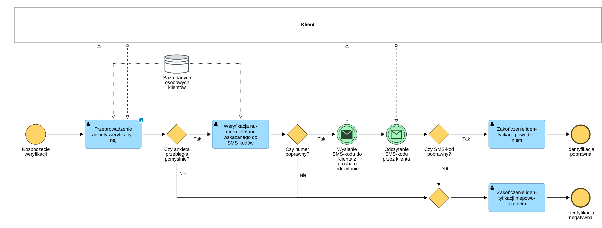

# BPMN_02_Weryfikacja_Klienta

## Cel procesu
Podproces mający na celu jednoznaczne potwierdzenie tożsamości osoby dzwoniącej na infolinię poprzez uwierzytelnianie dwuskładnikowe (wiedza + posiadanie urządzenia).

## Opis przebiegu procesu
1. Konsultant rozpoczyna procedurę, pobierając dane z bazy klientów i przeprowadzając ankietę weryfikacyjną.
2. System weryfikuje poprawność ankiety. W przypadku błędu proces kończy się identyfikacją negatywną.
3. Po pozytywnej ankiecie konsultant weryfikuje numer telefonu klienta przeznaczony do wysyłki kodów autoryzacyjnych.
4. Następuje wysłanie kodu SMS do klienta.
5. Klient odczytuje kod i przekazuje go konsultantowi.
6. Konsultant weryfikuje poprawność kodu. Jeśli kod jest poprawny, proces kończy się identyfikacją pozytywną. Błędny kod prowadzi do zakończenia niepowodzeniem.

## Uczestnicy procesu
| Rola | Odpowiedzialność |
| :--- | :--- |
| **Klient** | Udzielanie odpowiedzi na pytania ankiety, odczytanie i przekazanie kodu SMS. |
| **Konsultant (Infolinia)** | Zadawanie pytań, weryfikacja odpowiedzi i wprowadzanie danych do systemu. |

## Reguły biznesowe
| ID | Nazwa | Opis |
| :--- | :--- | :--- |
| **BR-03** | 2FA (Two-Factor Authentication) | Proces wymaga podwójnej weryfikacji: wiedzy klienta (ankieta) oraz posiadania zarejestrowanego numeru (SMS). |

## Podgląd diagramu

## Komentarz analityczny
Podproces został zaprojektowany z uwzględnieniem ścisłych wymogów bezpieczeństwa. Użycie bramek wykluczających (XOR) po każdym etapie weryfikacji gwarantuje, że proces zostanie przerwany natychmiast po wykryciu nieścisłości.
