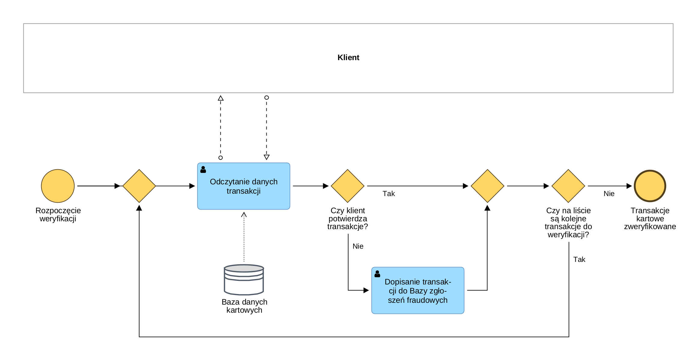

# BPMN_03_Weryfikacja_Transakcji

## Cel procesu
Podproces iteracyjny umożliwiający przejrzenie z klientem historii operacji kartowych w celu wyizolowania transakcji nieautoryzowanych (fraudowych) i zapisania ich w dedykowanej bazie zgłoszeń.

## Opis przebiegu procesu
1. Konsultant odczytuje dane kolejnej transakcji z bazy danych kartowych.
2. Klient pytany jest o potwierdzenie, czy zlecał daną transakcję.
3. Jeśli klient potwierdza operację (Tak), system przechodzi do kolejnego kroku weryfikacji.
4. Jeśli klient nie potwierdza operacji (Nie), transakcja zostaje dopisana do bazy zgłoszeń fraudowych.
5. System za pomocą bramki sprawdza, czy na liście znajdują się kolejne transakcje do weryfikacji.
6. Jeśli tak – proces zapętla się (wraca do odczytu danych). Jeśli nie – weryfikacja kończy się sukcesem.

## Uczestnicy procesu
| Rola | Odpowiedzialność |
| :--- | :--- |
| **Klient** | Weryfikacja autentyczności operacji na podstawie własnej pamięci i wiedzy. |
| **Konsultant (Infolinia)** | Prezentowanie danych o transakcjach, oznaczanie statusu w systemie. |

## Reguły biznesowe
| ID | Nazwa | Opis |
| :--- | :--- | :--- |
| **BR-04** | Izolacja transakcji | Tylko transakcje niepotwierdzone przez klienta mogą zostać sklasyfikowane jako fraud i przeniesione do bazy zgłoszeniowej. |

## Podgląd diagramu

## Komentarz analityczny
Wykorzystanie pętli (loop) w logice biznesowej to najlepsza praktyka przy obsłudze list danych. Proces elastycznie dopasowuje się do sytuacji – zadziała identycznie sprawnie przy weryfikacji jednej, jak i pięćdziesięciu podejrzanych transakcji.
