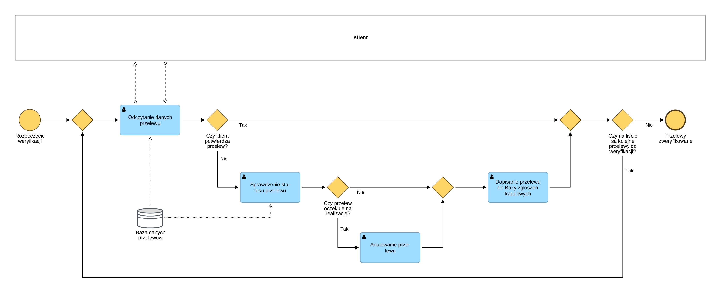

# BPMN_04_Weryfikacja_Przelewow

## Cel procesu
Podproces iteracyjny służący do przeglądu historii przelewów klienta. Pozwala nie tylko na identyfikację operacji fraudowych, ale także na natychmiastowe anulowanie tych z nich, które jeszcze nie opuściły systemu bankowego.

## Opis przebiegu procesu
1. Konsultant odczytuje dane kolejnego przelewu z bazy.
2. Klient potwierdza lub odrzuca autentyczność przelewu.
3. W przypadku potwierdzenia (Tak), system od razu weryfikuje, czy są kolejne pozycje na liście.
4. W przypadku niepotwierdzenia (Nie), konsultant sprawdza aktualny status przelewu w bazie.
5. Bramka decyzyjna weryfikuje, czy przelew oczekuje na realizację. 
   * Jeśli tak – następuje jego natychmiastowe anulowanie i dopisanie do bazy fraudów.
   * Jeśli nie (został już zrealizowany) – zostaje dopisany do bazy zgłoszeń fraudowych bez możliwości anulowania.
6. Następuje weryfikacja, czy lista zawiera kolejne przelewy do sprawdzenia (zapętlenie procesu lub jego zakończenie).

## Uczestnicy procesu
| Rola | Odpowiedzialność |
| :--- | :--- |
| **Klient** | Decyzja o autentyczności zleconego przelewu. |
| **Konsultant (Infolinia)** | Weryfikacja statusów księgowych, anulowanie operacji oczekujących. |

## Reguły biznesowe
| ID | Nazwa | Opis |
| :--- | :--- | :--- |
| **BR-05** | Anulowanie pending transfers | System pozwala na zablokowanie środków z nieautoryzowanego przelewu wyłącznie przed jego wysłaniem z banku (status "oczekuje"). |

## Podgląd diagramu

## Komentarz analityczny
Zastosowanie dodatkowej bramki weryfikującej status ("oczekuje na realizację") znakomicie odwzorowuje realia systemów bankowych. Pokazuje to głębokie zrozumienie cyklu życia przelewu w sesjach rozliczeniowych.
