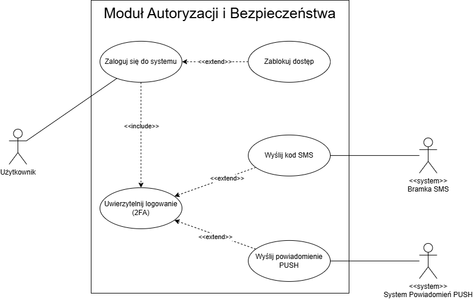

# 1. Diagram Przypadków Użycia (Use Case Diagram) – Moduł Autoryzacji i Bezpieczeństwa

Diagram przedstawia wysokopoziomowy zakres funkcjonalności modułu autoryzacji systemu bankowego. Definiuje głównych aktorów (użytkowników oraz systemy zewnętrzne) i ukazuje ich interakcje z systemem podczas bezpiecznego logowania.

### Uczestnicy systemu (Aktorzy)
* **Użytkownik** – główny aktor biznesowy inicjujący próbę dostępu do bankowości elektronicznej.
* **Bramka SMS (`<<system>>`)** – system zewnętrzny odpowiedzialny za dostarczanie jednorazowych kodów weryfikacyjnych.
* **System Powiadomień PUSH (`<<system>>`)** – zewnętrzna usługa infrastrukturalna realizująca wysyłkę autoryzacji bezpośrednio do aplikacji mobilnej klienta.

### Kluczowe relacje i reguły biznesowe
Architektura modułu opiera się na separacji logowania od weryfikacji dwuetapowej, co zobrazowano poprzez zaawansowane relacje UML:

* **Zależność bezwzględna (`<<include>>`):** 
  Proces *„Zaloguj się do systemu”* bezwzględnie zawiera (include) krok *„Uwierzytelnij logowanie (2FA)”*. Oznacza to, że ze względów bezpieczeństwa w tym banku nie istnieje możliwość zalogowania się z pominięciem drugiego składnika autoryzacji.
* **Ścieżki warunkowe (`<<extend>>`):**
  * *„Zablokuj dostęp”* – jest to scenariusz rozszerzający, uruchamiany wyłącznie w przypadku wystąpienia anomalii lub naruszenia reguł bezpieczeństwa (np. zbyt wiele błędnych prób hasła lub wykrycie fraudu).
  * *Wybór metody 2FA* – metody *„Wyślij kod SMS”* oraz *„Wyślij powiadomienie PUSH”* rozszerzają krok uwierzytelniania. Oznacza to, że system dynamicznie wybiera jeden z tych kanałów na podstawie preferencji użytkownika lub dostępności urządzenia powiązanego.

### Diagram

_Diagram opracowano w notacji UML (Use Case Diagram) w narzędziu draw.io._
