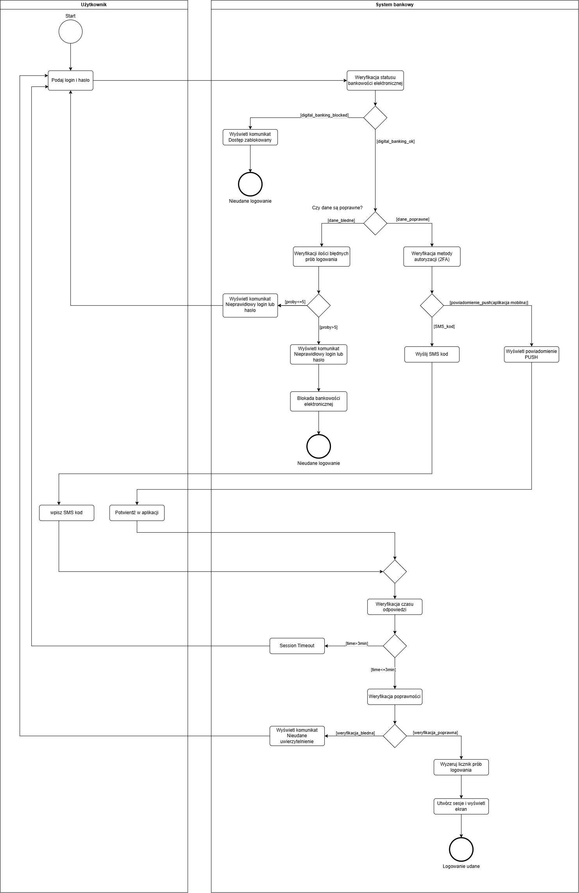

# 2. Diagram Aktywności (Activity Diagram) – Przepływ procesu autoryzacji

Diagram Aktywności wizualizuje krok po kroku przepływ sterowania (Control Flow) podczas procesu logowania. Proces został podzielony na dwa tory decyzyjne (Swimlanes): akcje podejmowane przez „Użytkownika” oraz logikę przetwarzaną przez „System bankowy”[cite: 6]. 

Diagram nie tylko obrazuje ścieżkę sukcesu, ale przede wszystkim skupia się na wyjątkach i rygorystycznych regułach bezpieczeństwa, chroniących dostęp do rachunku.

### Ścieżka główna (Happy Path)
1. Użytkownik podaje login i hasło[cite: 6].
2. System bankowy pozytywnie weryfikuje status konta (`[digital_banking_ok]`) oraz poprawność danych uwierzytelniających (`[dane_poprawne]`)[cite: 6].
3. Następuje weryfikacja preferowanej metody 2FA i wysyłka kodu (SMS) lub powiadomienia (PUSH)[cite: 6].
4. Użytkownik potwierdza logowanie w wymaganym czasie (`[time<=3min]`)[cite: 6].
5. Po pozytywnej weryfikacji kodu system zeruje licznik błędnych prób, tworzy sesję i wyświetla główny ekran (Logowanie udane)[cite: 6].

### Reguły biznesowe i ścieżki alternatywne (Security Rules)

* **Prewencja Fraudowa (Fail-Fast):**
  Zaraz po otrzymaniu żądania logowania, system sprawdza status konta. Jeśli nałożono na nie blokadę operacyjną (`[digital_banking_blocked]`), proces jest natychmiast przerywany bez sprawdzania poprawności hasła[cite: 6]. Zwiększa to wydajność i chroni przed atakami typu Brute Force.
* **Polityka limitu prób logowania:**
  W przypadku podania błędnych danych (`[dane_bledne]`), system weryfikuje licznik nieudanych prób[cite: 6]. 
  * Gdy `[proby<=5]`: Wyświetlany jest standardowy komunikat o błędzie i użytkownik może ponowić próbę[cite: 6].
  * Gdy `[proby>5]`: Następuje automatyczna blokada bankowości elektronicznej, zabezpieczająca konto klienta przed przejęciem[cite: 6].
* **Session Timeout (Kontrola czasu 2FA):**
  Wprowadzono mechanizm weryfikacji czasu odpowiedzi przy wprowadzaniu drugiego składnika[cite: 6]. Przekroczenie limitu 3 minut (`[time>3min]`) powoduje unieważnienie procesu ("Session Timeout") i wymusza ponowne rozpoczęcie logowania od zera[cite: 6].
* **Dynamiczny routing 2FA:**
  Proces rozwidla się w zależności od aktywnej metody autoryzacji klienta, płynnie obsługując zarówno starsze kanały (`[SMS_kod]`), jak i nowoczesne (`[powiadomienie_push]`)[cite: 6].

### Diagram

