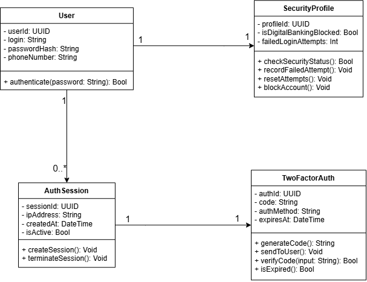

# 3. Diagram Klas (Class Diagram) – Model domenowy autoryzacji

Diagram Klas przedstawia statyczną strukturę systemu, definiując główne encje, ich atrybuty (dane), metody (zachowania) oraz relacje między nimi. 

Model został zaprojektowany z silnym naciskiem na bezpieczeństwo, hermetyzację danych oraz architektoniczną zasadę **Single Responsibility Principle (SRP)** – logika konta, profilu bezpieczeństwa i zarządzania sesją zostały wyraźnie odseparowane.

### Kluczowe klasy i ich odpowiedzialność biznesowa

* **`User` (Użytkownik)**
  Centralna klasa agregująca dane klienta. Ze względów bezpieczeństwa system nie przechowuje hasła w postaci jawnej, lecz wykorzystuje atrybut `passwordHash`. Klasa udostępnia kluczową metodę `authenticate()`, która weryfikuje poprawność danych uwierzytelniających.
* **`SecurityProfile` (Profil Bezpieczeństwa)**
  Klasa dedykowana wyłącznie logice antyfraudowej (wydzielona z klasy User dla zachowania czystości architektury). Zarządza licznikiem błędnych prób (`failedLoginAttempts`) oraz flagą blokady dostępu (`isDigitalBankingBlocked`). Udostępnia metodę `blockAccount()`, która jest wywoływana po przekroczeniu limitu zdefiniowanego na Diagramie Aktywności.
* **`AuthSession` (Sesja Autoryzacyjna)**
  Obiekt tworzony po pomyślnym zalogowaniu. Przechowuje unikalny identyfikator sesji (`sessionId`), czas utworzenia (`createdAt`) oraz adres IP klienta (`ipAddress`). Odpowiada za utrzymanie i terminację dostępu.
* **`TwoFactorAuth` (Autoryzacja Dwuskładnikowa)**
  Moduł obsługujący jednorazowe kody (OTP). Zawiera kluczowe metody `generateCode()` oraz `verifyCode()`. Atrybut `expiresAt` bezpośrednio realizuje regułę biznesową "Session Timeout" (3 minuty ważności kodu).

### Relacje obiektowe (Kardynalność)

* **`User` [1] --- [1] `SecurityProfile`**
  Relacja jeden-do-jednego. Każdy użytkownik systemu posiada dokładnie jeden, nierozerwalnie z nim związany profil bezpieczeństwa.
* **`User` [1] --- [0..*] `AuthSession`**
  Relacja jeden-do-wielu. Jeden użytkownik może wygenerować zero (nigdy się nie logował) lub wiele (wiele historycznych logowań) sesji autoryzacyjnych na przestrzeni czasu.
* **`AuthSession` [1] --- [1] `TwoFactorAuth`**
  Silne powiązanie jeden-do-jednego. Każda nowo tworzona próba sesji wymaga dokładnie jednego, unikalnego procesu weryfikacji 2FA.

### Diagram

