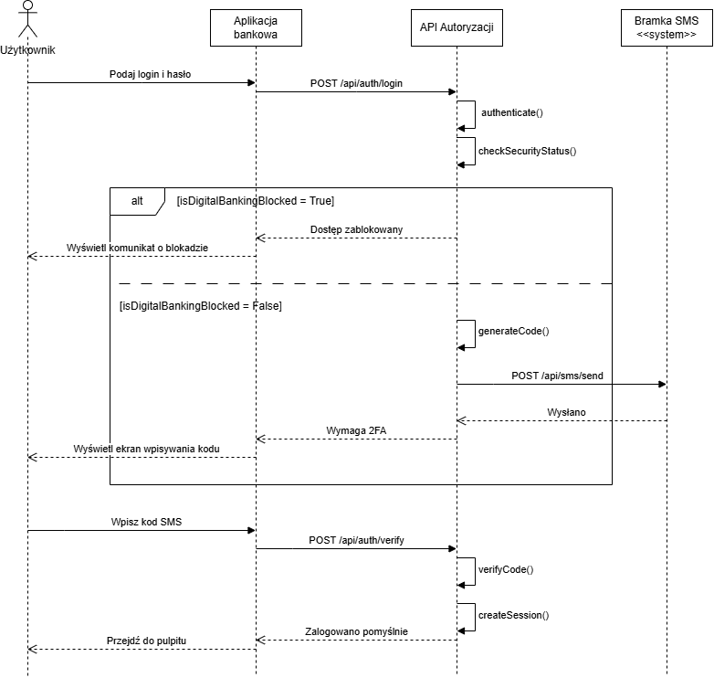

# 4. Diagram Sekwencji (Sequence Diagram) – Komunikacja API w procesie autoryzacji

Diagram Sekwencji przedstawia architekturę systemu. Obrazuje ona dokładną wymianę komunikatów i wywołań sieciowych między aplikacją kliencką, serwerem banku (API) oraz systemami zewnętrznymi, niezbędną do realizacji procesu bezpiecznego logowania.

### Uczestnicy procesu
* **Użytkownik** – inicjuje proces i wprowadza dane.
* **Aplikacja bankowa (Frontend)** – interfejs klienta; odpowiada za komunikację z serwerem oraz wyświetlanie odpowiednich widoków.
* **API Autoryzacji (Backend)** – serwer centralny; przetwarza logikę biznesową, weryfikuje zabezpieczenia i zarządza sesjami.
* **Bramka SMS (`<<system>>`)** – zewnętrzny dostawca usług telekomunikacyjnych realizujący wysyłkę kodów OTP.

### Opis przebiegu głównego (Ścieżka sukcesu)

1. **Inicjalizacja:** Użytkownik wprowadza dane do logowania, a Aplikacja bankowa wysyła żądanie `POST /api/auth/login` do API Autoryzacji.
2. **Wewnętrzna weryfikacja serwera (Self-calls):** 
   * API wykonuje wywołanie `authenticate()`, aby zweryfikować poprawność hasła na poziomie bazy danych.
   * Następnie uruchamiana jest metoda `checkSecurityStatus()`, badająca profil klienta pod kątem blokady antyfraudowej.
3. **Generowanie i wysyłka 2FA:** Po pomyślnej weryfikacji API generuje kod OTP (`generateCode()`) i deleguje jego wysyłkę do systemu zewnętrznego poprzez wywołanie `POST /api/sms/send`.
4. **Weryfikacja drugiego składnika:** 
   * Użytkownik wprowadza otrzymany kod w aplikacji, co skutkuje wysłaniem żądania `POST /api/auth/verify`.
   * API wykonuje weryfikację wewnętrzną (`verifyCode()`).
5. **Autoryzacja (Finał):** Serwer tworzy bezpieczną sesję (`createSession()`) i zwraca do aplikacji komunikat o pełnym sukcesie operacji (Zalogowano pomyślnie).

### Scenariusze alternatywne (Ramka ALT)

Zastosowano blok warunkowy `alt`, aby udokumentować krytyczne rozwidlenie logiki biznesowej, bezpośrednio powiązane z prewencją antyfraudową:
* **Warunek `[isDigitalBankingBlocked = True]`:** Jeżeli w kroku sprawdzania profilu bezpieczeństwa system wykryje aktywną blokadę, proces natychmiast ulega przerwaniu. API odrzuca żądanie komunikatem o braku dostępu ("Dostęp zablokowany"), omijając całkowicie kosztochłonny krok generowania wiadomości SMS.

### Uwagi techniczne
* Projekt opiera się na architekturze typu Client-Server przy wykorzystaniu protokołu HTTP.
* Zastosowano standardową konwencję metod dla żądań modyfikujących stan i przesyłających wrażliwe dane (`POST`).
* Linie przerywane symbolizują komunikaty zwrotne (Response), które informują stronę wywołującą o zakończeniu konkretnego przetwarzania.

### Diagram

